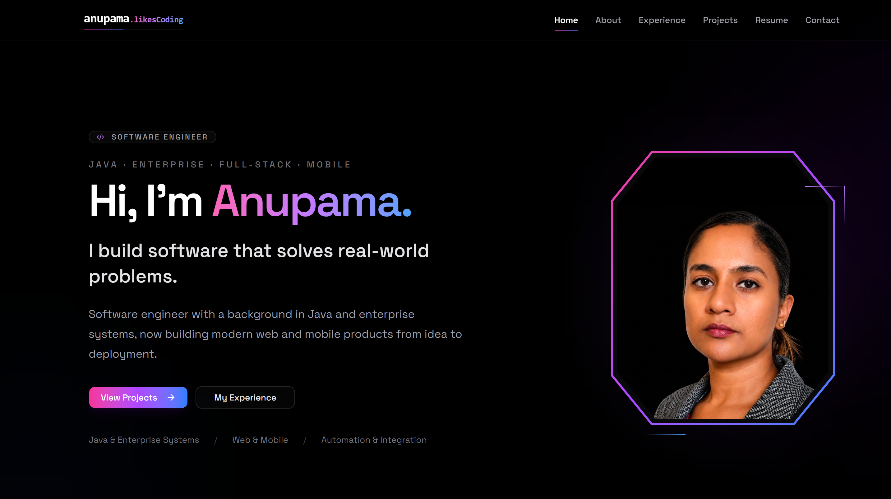

# Anupama Rajendra — Developer Portfolio

A modern personal portfolio presenting my experience across **Java, enterprise systems, SQL, Unix / Shell Scripting, full-stack web development, mobile applications, and independent software projects**.

## Live Portfolio

🌐 **View the portfolio:**  
https://A-nu-1.github.io/anupamaportfolio/



---

## About This Portfolio

This portfolio brings together my professional background, recent independent development work, selected projects, technical skills, and résumé in one place.

The site is designed to be:

- Clean and recruiter-friendly
- Responsive across desktop and mobile
- Easy to navigate
- Suitable for technical and non-technical visitors
- Useful for real job-application workflows
- Printable and ATS-friendly

---

## Main Sections

### Home

A concise overview of my background, featured work, career snapshot, and contact call-to-action.

### About

My engineering journey from **Java and enterprise software development** to modern web and mobile application development.

### Experience

A chronological view of my professional experience across:

- Independent / freelance software development
- Credit Suisse
- Cognizant Switzerland
- Meyer Burger
- Applied Materials
- Cisco

### Projects

Selected work including:

- Client Commerce Platforms
- Bhajans
- Travel Planner
- Ecommerce Application
- Solar System
- React CuteBot
- Store Stories

### Resume

A printable one-page résumé containing:

- Professional experience
- Clear month/year employment timelines
- Technical skills
- Selected projects
- Education
- Languages
- Swiss work authorization

The résumé also supports:

- Copy Resume
- Download as TXT
- Print / Save as PDF

### Contact

A contact page powered by EmailJS with location, GitHub information, and direct enquiry support.

---

## Featured Projects

### Client Commerce Platforms

Two independently developed commerce ecosystems:

- **Lucky's Collection**
- **A Home Cook**

The platforms cover complete web and Android commerce workflows including:

- Storefronts
- Product and category management
- Cart and checkout
- Customer orders
- Admin dashboards
- Authentication
- Email and Google login
- Notifications
- Analytics
- AI-assisted product workflows
- Natural-language product discovery
- Caching and performance optimisation
- Configurable storefront settings
- Catalog mode
- Mobile customer and admin workflows
- Cost-conscious infrastructure design

The systems were designed around a strong goal of keeping infrastructure costs at **0 CHF wherever feasible**, while still providing real production functionality.

---

### Bhajans

A multilingual devotional lyrics platform created for my spiritual community.

The project was built to solve a practical problem: maintaining and navigating a very large collection of devotional songs.

Features include:

- Fast song search
- Categories
- Favorites
- Structured paragraph-based reading
- Previous / next navigation
- Multilingual content
- Kannada and English support
- Transliteration tools
- Bulk paragraph conversion
- Language configuration
- Administrative tools
- Web and Android applications

---

### Travel Planner

A travel-planning application designed to make trip organisation easier.

Features include:

- Trip creation
- Destination management
- Day-by-day itineraries
- Interactive maps
- Travel dashboards
- Drag-and-drop planning
- Travel history
- Interactive globe visualisation

---

### Ecommerce Application

A full-stack ecommerce application supporting:

- Product browsing
- Product ratings
- Cart management
- Checkout
- Delivery options
- Order history
- Reordering
- Shipment tracking

Built with React, Express, Sequelize, and SQL.

---

## Technical Stack

### Core Engineering

- Java
- J2EE
- Spring
- Hibernate
- OOP
- SQL
- Unix
- Shell Scripting

### Frontend

- React
- Vite
- JavaScript
- TypeScript
- Next.js
- Tailwind CSS
- shadcn/ui
- Lucide Icons

### Mobile

- React Native
- Expo

### Backend & Data

- Node.js
- PostgreSQL
- Supabase
- Prisma
- Oracle
- MSSQL
- REST APIs

### Integration & Operations

- MQ
- File Transfer
- Enterprise Integration
- Production Support
- Monitoring
- Automation

### Portfolio-Specific Technologies

- React Router
- EmailJS
- GitHub Pages
- GitHub Actions

---

## UI / Design

The portfolio uses a dark, minimal visual design with subtle pink, purple, and blue accent gradients.

Design goals include:

- Professional presentation
- Strong readability
- Consistent visual hierarchy
- Responsive layouts
- Restrained animations
- Accessible navigation
- Visual project storytelling without excessive decoration

---

## Responsive Features

The portfolio is designed for desktop, tablet, and mobile devices.

Features include:

- Responsive navigation
- Mobile navigation drawer
- Touch-friendly project galleries
- Swipeable image carousels
- Click-to-expand screenshots
- Responsive project cards
- Responsive case studies
- Mobile-friendly résumé layout

---

## Resume Features

The résumé page was designed around real recruitment and application workflows.

It includes:

- Clear MM/YYYY professional timelines
- Role, company, location, and description structure
- ATS-friendly content
- Swiss C Permit information
- Java and enterprise experience
- SQL emphasis
- Unix / Shell Scripting emphasis
- Modern web and mobile skills
- Selected projects
- Education and language information

Additional tools make applications easier:

- **Copy Resume** — copies the full résumé as plain text
- **Download TXT** — downloads an ATS-friendly text version
- **Print Resume** — creates a clean A4 résumé that can also be saved as PDF

---

## Project Structure

```text
src/
├── assets/
│   └── projects/
├── components/
│   ├── sections/
│   └── ui/
├── pages/
├── lib/
├── App.jsx
├── App.css
└── main.jsx
```

---

## Running Locally

Clone the repository:

```bash
git clone https://github.com/A-nu-1/anupamaportfolio.git
```

Open the project folder:

```bash
cd anupamaportfolio
```

Install dependencies:

```bash
npm install
```

Start the development server:

```bash
npm run dev
```

The application will normally be available locally at:

```text
http://localhost:5173/
```

---

## Environment Variables

The contact form uses EmailJS.

Create a local `.env` file in the project root:

```env
VITE_SERVICE_ID=your_service_id
VITE_TEMPLATE_ID=your_template_id
VITE_PUBLIC_KEY=your_public_key
```

The `.env` file should not be committed to Git.

For deployment, the corresponding values are configured through GitHub Actions repository settings.

---

## Production Build

Create a production build with:

```bash
npm run build
```

The generated production files are written to:

```text
dist/
```

---

## Deployment

The portfolio is deployed using:

- **GitHub Pages**
- **GitHub Actions**

The production Vite base path is:

```text
/anupamaportfolio/
```

Each push to the `main` branch automatically triggers the GitHub Actions deployment workflow.

Live site:

https://A-nu-1.github.io/anupamaportfolio/

---

## Routing

The application uses React Router.

GitHub Pages deployment includes an SPA fallback so routes such as:

```text
/about
/experience
/projects
/resume
/contact
```

can be opened directly in the deployed application.

---

## Author

### Anupama Rajendra

Software Engineer

**Java · SQL · Unix / Shell Scripting · Enterprise Integration · Full-Stack · Mobile**

📍 Mägenwil, Aargau, Switzerland  
🇨🇭 Swiss C Permit

### Links

**Portfolio**  
https://A-nu-1.github.io/anupamaportfolio/

**GitHub**  
https://github.com/A-nu-1

---

Thanks for visiting.